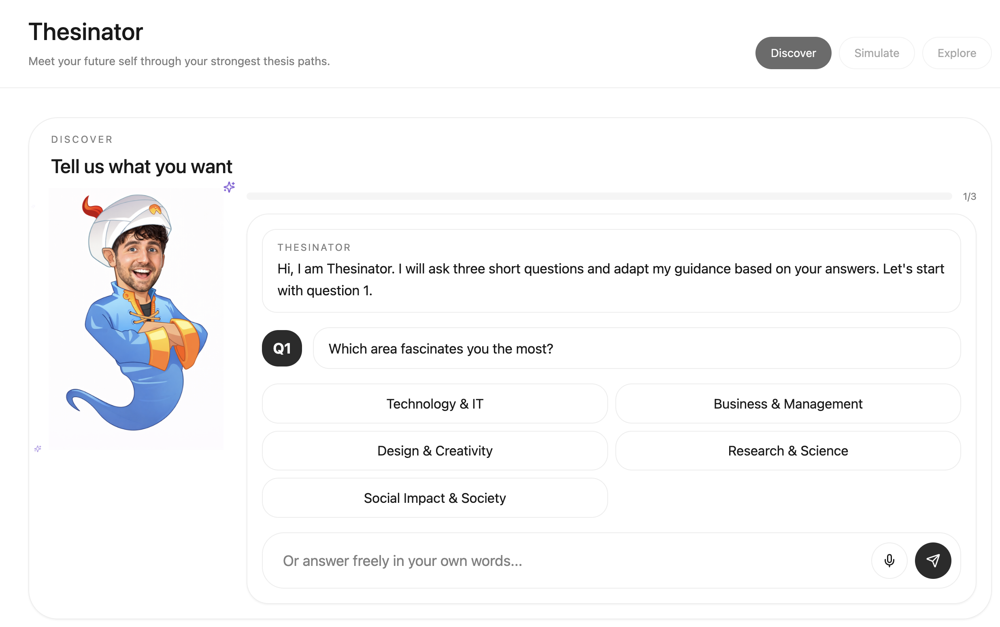
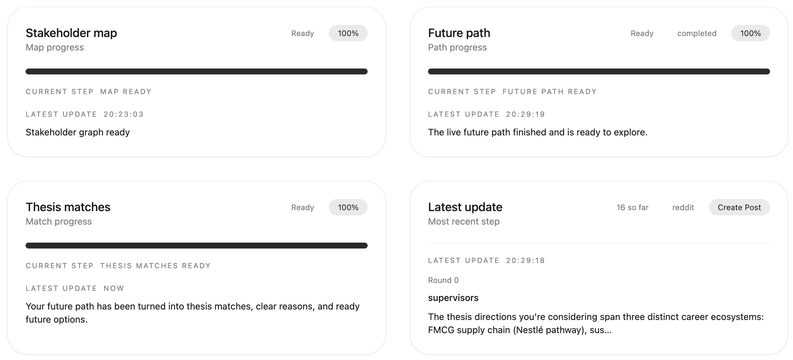
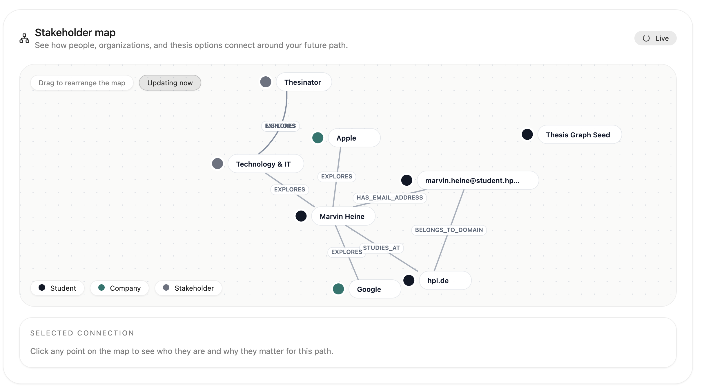
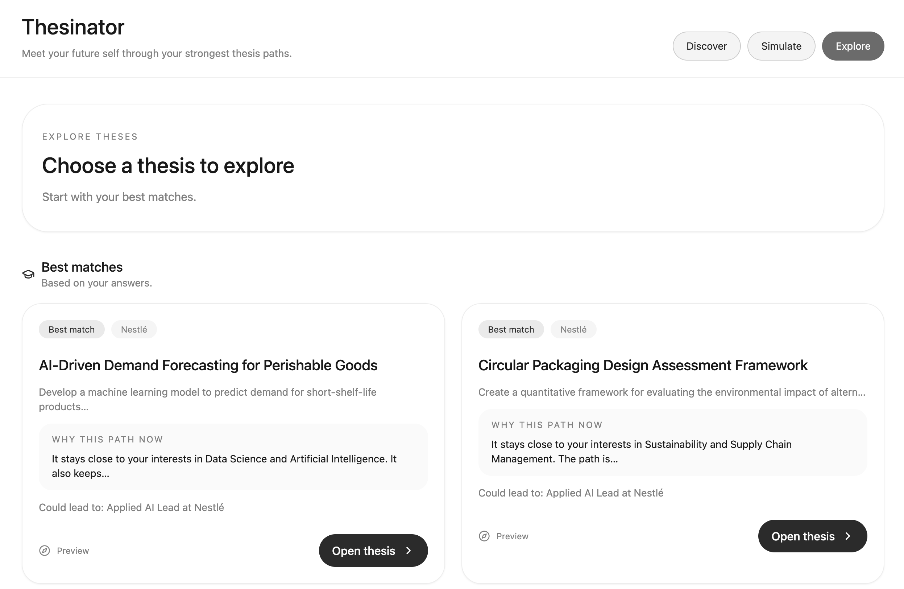
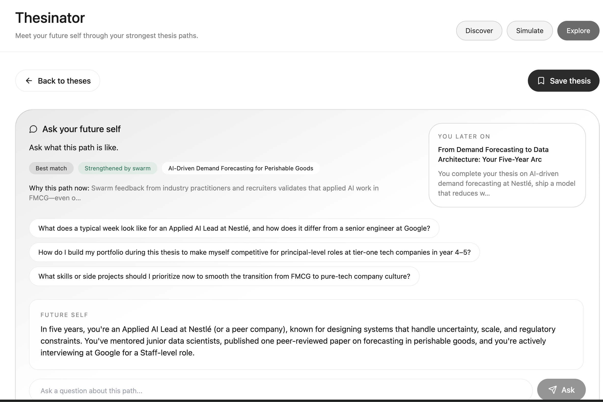

# Thesinator

Thesinator is an AI-powered thesis discovery and future-planning prototype for Studyond.

This project was developed during [START Hack](https://www.startglobal.org/start-hack), organized by START Global.

This repository is a multi-project workspace containing the student-facing app, Supabase backend, and MiroFish simulation engine that power the experience.

## Screenshots

### Discover

Thesinator starts with a guided question flow that captures the student's interests and narrows the thesis search space.



### Simulation Engine

After the student picks a direction, Thesinator runs a live multi-step simulation that prepares stakeholder context, future paths, and thesis reasoning in parallel.



### Live Stakeholder Map

As the graph builds, students can inspect a live stakeholder map that connects people, organizations, and thesis directions around their future path.



### Explore Theses

Once the simulation finishes, the student can browse thesis paths with concrete reasons, likely outcomes, and company or domain context.



### Ask Your Future Self

Each thesis path opens into a future-self view where the student can inspect the long-term arc and ask grounded follow-up questions.



## What Is Active In This Repo?

- `thesis-navigator-main/`: the current student-facing web app
- `supabase/`: the local backend, database schema, seed data, generated types, and edge functions
- `MiroFish/backend/`: the hidden simulation engine used for the live "See your future" flow

Also present:
- `MiroFish/frontend/`: older Vue-based debug UI for MiroFish
- `mock-data/`: source JSON used to generate local seed data
- `Documentation/`: architecture and product notes
- `MiroFish/start-hack-2026-studyond/`: hackathon context, brand, and research material
- `ContextLegacyOldTool/` and `ChatAgent/`: legacy/support folders, not part of the active runtime

## Architecture

```text
                         mock-data/*.json
                               |
                               v
                       supabase/seed.sql
                               |
                               v
 +------------------------+    SQL/RPC    +----------------------------+
 | Supabase Postgres      | <-----------+ | Supabase Edge Functions    |
 | topics, sessions,      |             | | - thesinator-chat          |
 | future sessions,       |             | | - future-sessions          |
 | graph/swarm status     |             | +----------------------------+
 | pgvector matching      |             |               ^
 +------------------------+             |               |
           ^                            |         invoke/fetch
           |                            |               |
           |                            |     +-------------------------+
           |                            +---- | thesis-navigator-main   |
           |                                  | React student UI        |
           |                                  +-------------------------+
           |                                                   |
           |                                             poll live future
           |                                                   v
           |                                  +-------------------------+
           +--------------------------------- | MiroFish backend        |
                                              | Flask graph + swarm sim |
                                              +-------------------------+
                                                         |
                           +-----------------------------+----------------------------+
                           |                             |                            |
                           v                             v                            v
                    LiteLLM + OpenAI SDK            Zep Cloud                 CAMEL-AI / OASIS
                    model access for MiroFish       graph memory              multi-agent simulation
```

Notes:
- `thesinator-chat` also calls Anthropic for answer interpretation and OpenAI for embeddings.
- `future-sessions` calls Anthropic for future generation/chat and bridges to MiroFish over HTTP.
- `start_all.sh` wires the edge runtime to MiroFish via `http://host.docker.internal:5001`.

## Repo Map

- `thesis-navigator-main/`: Vite/React app for `Discover -> See your future -> Explore theses -> Detail`
- `supabase/functions/`: backend APIs for thesis matching and future-session orchestration
- `supabase/migrations/`: Postgres schema, vector matching logic, and future-session state tracking
- `supabase/types/`: generated database TypeScript types
- `MiroFish/backend/app/api/studyond.py`: Studyond-specific adapter endpoints used by the edge layer
- `MiroFish/backend/app/services/`: graph building, simulation setup, swarm execution, reporting, and Zep integration
- `scripts/embed-seed.ts`: embedding backfill for seeded topics
- `mock-data/`: source dataset for students, companies, supervisors, experts, fields, and topics
- `Documentation/`: higher-level architecture and PRD notes
- `MiroFish/start-hack-2026-studyond/`: hackathon context vault, brand system, and mock data copy

## Technologies And What They Are Used For

### Student App

| Technology | Used for in this repo |
| --- | --- |
| Vite 5 | Frontend dev server and production build pipeline for `thesis-navigator-main/` |
| React 18 | Student-facing single-page app and the thesis/future flow UI |
| TypeScript | Typed frontend services, UI state, and Supabase payload contracts |
| React Router | The app shell and page routing in `src/App.tsx` |
| Tailwind CSS | Utility-first styling, theme tokens, and layout system |
| Radix UI + shadcn/ui | Reusable accessible UI primitives in `src/components/ui/` |
| TanStack Query | App-wide async/query foundation via `QueryClientProvider` |
| D3 | Rendering the live future path / graph preview visualization |
| Browser Speech Recognition API | Optional voice input during the 3-question discovery wizard |
| Vitest + Testing Library | Frontend unit/component tests |
| Playwright | Browser automation config scaffold in the frontend project |

### Backend And Data

| Technology | Used for in this repo |
| --- | --- |
| Supabase CLI | Running the local API, Postgres, Studio, and edge-function workflow |
| Docker | Underpins the local Supabase stack and the containerized MiroFish option |
| Postgres | Stores thesis topics, user/session state, ranked matches, and future-session progress |
| pgvector | Embedding storage and similarity scoring for topic/profile matching |
| Supabase Edge Functions (Deno + TypeScript) | Server-side APIs for `thesinator-chat` and `future-sessions` |
| Supabase JS | Browser-side function calls and edge/database clients |
| SQL migrations + RPCs | Schema management plus matching logic like `refresh_session_top_topics` |
| OpenAI Embeddings API | Creating topic/profile embeddings for vector search and ranking |
| Anthropic API | Interpreting student answers, generating futures, and powering future-self chat |
| ElevenLabs API | Returning spoken audio (`audio_b64`) for assistant replies in the thesis wizard |
| `scripts/embed-seed.ts` (Deno) | Backfilling topic embeddings after seeding or topic updates |

### Simulation Engine

| Technology | Used for in this repo |
| --- | --- |
| Python 3.11 | Runtime for the MiroFish backend |
| Flask | HTTP API server for graph building, simulation, reporting, and Studyond adapter routes |
| Flask-CORS | Allowing cross-origin calls to the MiroFish API routes |
| uv | Python environment/dependency management and command runner for MiroFish |
| OpenAI SDK | Unified OpenAI-compatible client inside MiroFish for model calls |
| LiteLLM | Local proxy translating OpenAI-style calls to Anthropic for MiroFish |
| Zep Cloud | Graph memory store used to build/read stakeholder graphs and entity context |
| CAMEL-AI / CAMEL OASIS | Multi-agent social/swarm simulation used by MiroFish |
| Pydantic | Structured data and ontology/model definitions inside MiroFish services |
| PyMuPDF | Parsing uploaded PDF seed material in the MiroFish backend |
| python-dotenv | Loading `MiroFish/.env` configuration into the backend |

### Legacy And Support Material

| Technology | Used for in this repo |
| --- | --- |
| Vue 3 + Vue Router | Older MiroFish frontend in `MiroFish/frontend/` |
| Axios | HTTP client dependency in the legacy Vue frontend |
| JSON mock data | Source records used to generate seeded local catalog data |
| Markdown docs/context vault | Architecture docs, PRD, brand system, and hackathon knowledge base |

## Runtime Flow

1. The browser loads `thesis-navigator-main/`.
2. The 3-question discovery flow calls `supabase/functions/thesinator-chat`.
3. `thesinator-chat` stores session data, updates the context snapshot, generates optional audio, and ranks thesis topics using structured logic plus embeddings.
4. The frontend creates a `future_session` through `supabase/functions/future-sessions`.
5. `future-sessions` generates future cards, starts graph building and swarm simulation in MiroFish, and persists graph/swarm/finalization state in Postgres.
6. The frontend polls `/functions/v1/future-sessions/:id/graph` and related endpoints to render live events, preview graph nodes/edges, future cards, and future-self chat.

## Local Startup

From the repo root:

```bash
./start_all.sh
```

That script:
- starts or restarts local Supabase
- resets and reseeds the database
- starts the LiteLLM proxy
- starts the hidden MiroFish backend
- serves the Supabase edge functions
- starts the React frontend
